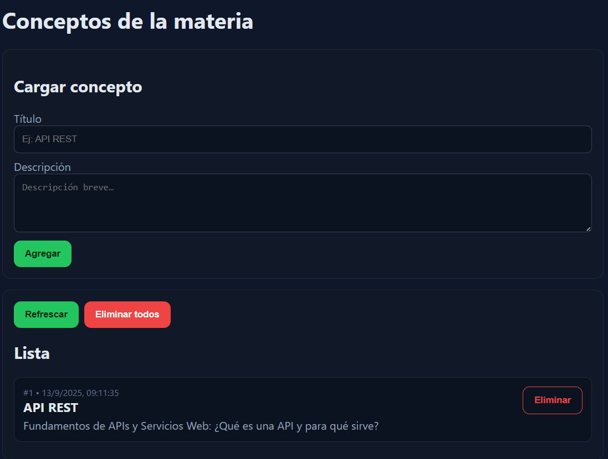
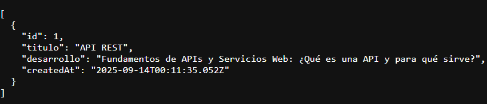
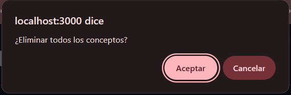
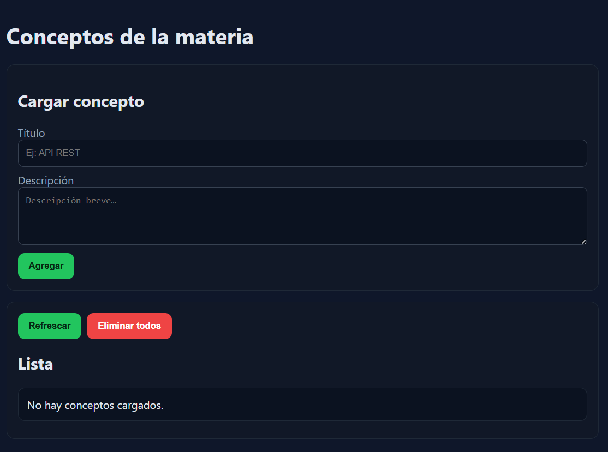
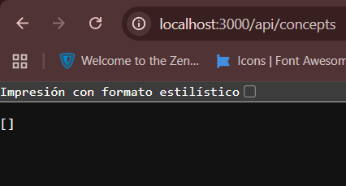

# TP Taller de Programación 2

## Descripción 
Esta aplicación permite cargar conceptos vistos en la materia, listarlos y eliminarlos.
El backend fue hecho en Node.js. Frontend con HTML, CSS y JS.

## Endpoints
- `POST /api/concepts` (agregado para la UI)
- `GET /api/concepts` 
- `GET /api/concepts/:id`
- `DELETE /api/concepts`
- `DELETE /api/concepts/:id`

## Casos de prueba

### 1. Alta de un concepto
- Se da de alta un concepto y este aparece tanto en el listado del index como en `/api/concepts`

---

### 2. Eliminar todos los conceptos
- Al eliminar todos los conceptos, todos desaparecen del listado y de `/api/concepts` dejando la lista vacia `[]`

---

## Conclusiones
- Aprendí a manejar un repositorio con ramas (main y test) y a usar commits descriptivos. Sobretodo entendí la importancia de la rama test para hacer pruebas y luego pasar los cambios ya estables a main.
- Me resultó difícil al inicio configurar Node.js y Git, pero pude entender cómo levantar un servidor básico y probar solicitudes REST.
- Diría que lo mas complicado de entender a nivel código es server.js, Pero nada que no se pueda aprender con práctica.